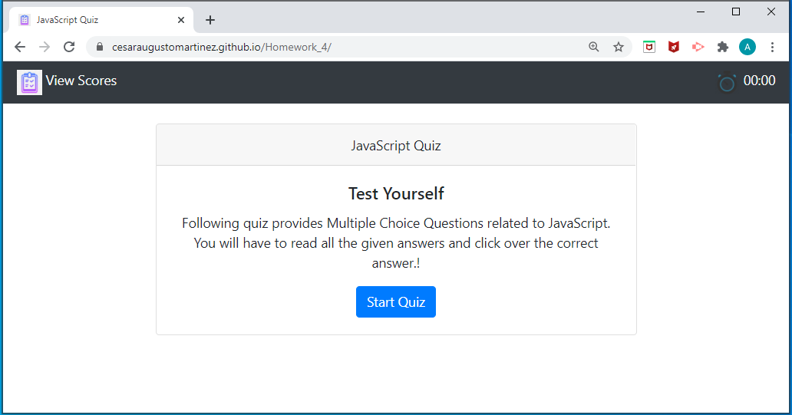
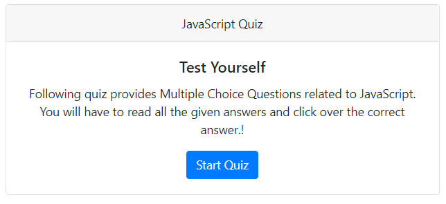
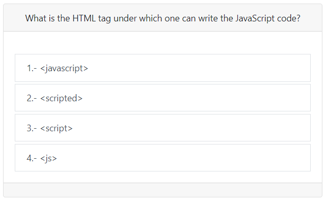
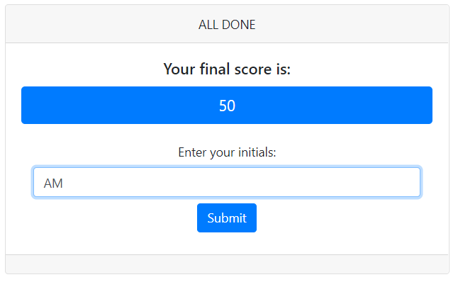
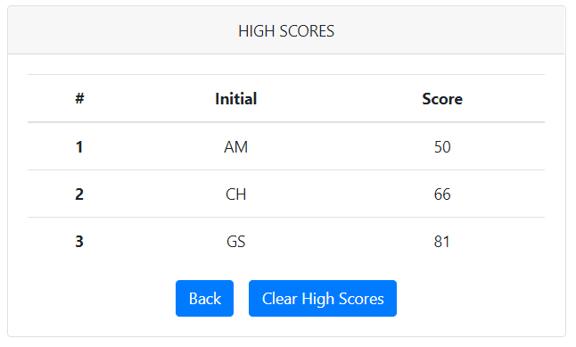
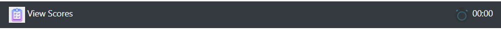

# JavaScript Quiz



Link : [Project Link](https://cesaraugustomartinez.github.io/Homework_4/)

---

### Table of Contents

- [Description](#description)
- [How to Use](#how-to-use)
- [Screenshots](#screenshots)
- [References](#references)
- [License](#license)
- [Author Info](#author-info)

---

## Description

The goal of this project is generate a Quiz which provides multiple choice questions related to JavaScript. The user will have to read all the given answers and click over the correct answer. This app was builded using Javascript code to generate a dynamically HTML and CSS pages. 

##### Technologies

- Html
- JavaScript
- Visual Studio Code
- CSS
- Bootstrap

##### Code sample - Javascript
#
```js
// Creating an array with all the question and answers
var questions = [ 
    {
    title: "What is the HTML tag under which one can write the JavaScript code?",
    choices: ["<javascript>", "<scripted>", "<script>", "<js>"],
    answer: "<script>"},
    {
    title: "Which of the following is the correct syntax to display “GeeksforGeeks” in an alert box using JavaScript?",
    choices: ["alertbox(“GeeksforGeeks”);", "msg(“GeeksforGeeks”);", "msgbox(“GeeksforGeeks”);", "alert(“GeeksforGeeks”);"],
    answer: "alert(“GeeksforGeeks”);"}, 
    {
    title: "What is the correct syntax for referring to an external script called “geek.js”?",
    choices: ["<script src=”geek.js”>", "<script href=”geek.js”>", "<script ref=”geek.js”>", "<script name=”geek.js”>"],
    answer: "<script src=”geek.js”>"},
    {
    title: "Which of the following is not a reserved word in JavaScript?",
    choices: ["interface", "throws", "program", "short"],
    answer: "program"},
    {
    title: "How is the function called in JavaScript?",
    choices: ["call Geekfunc();", "call function GeekFunc();", "Geekfunc();", "function Geekfunc();"],
    answer: "Geekfunc();"}]

function startQuiz(){ // To generate the first display for start the Quiz 
    // Setting attribute to the element 
    card.setAttribute("class","card text-center");
    cardHeader.setAttribute("class","card-header");
    cardHeader.textContent = "JavaScript Quiz";
    cardBody.setAttribute("class","card-body");
    cardTitle.setAttribute("class","card-title");
    cardTitle.textContent = "Test Yourself";
    cardText.setAttribute("class","card-text");
    cardText.textContent = "Following quiz provides Multiple Choice Questions related to JavaScript. You will have to read all the given answers and click over the correct answer.!";
    startButton.setAttribute("class","btn btn-primary");
    startButton.textContent = "Start Quiz";

    // To create new elements to the document.
    cardBody.appendChild(cardTitle);
    cardBody.appendChild(cardText);
    cardBody.appendChild(startButton);
    card.appendChild(cardHeader);
    card.appendChild(cardBody);
    card.appendChild(cardFooter);
    mainElem.append(card);

    //Setting the event click
    startButton.addEventListener("click", generateQuestion);

}

```

---

## How To Use

This web application has two webpages index.html and highScores.html. The index.html page has has a button to start the quiz. Then it will provide six questions with four answer each one. When the user click over the correct answer, It goes to the next question. Once asnwered all question, It will show a card to enter the user's initial. The User will have a link to look at a table with the scores. This app has some criterias described following: 

- A timer stars when the user click start button.

- Time is subtracted from the clock if the answer is wrong.

- If the timer reach cero the quiz is over.

 
## Screenshots

- First card with a button to start the Quiz



- Model Question 



- Card for User's initials and submit button



- Table Scores, back button, and clear button into the highScores.html page



- Link to highScores.hmtl page and Timer




[Back To The Top](#JavaScript-Quiz)

---

## References

- w3school -- [JavaScript Tutorial](https://www.w3schools.com/js/default.asp)
- Bootstrap -- [Build fast, responsive sites with Bootstrap](https://getbootstrap.com/)
- W3school -- [The HTML DOM Element Object](https://www.w3schools.com/jsref/dom_obj_all.asp)


[Back To The Top](#JavaScript-Quiz)

---

## License

Copyright (c) [2020] [Cesar A Martinez]

[Back To The Top](#JavaScript-Quiz)

---

## Author Info

- Twitter -- [@cesaguma](https://twitter.com/cesaguma)
- Linkedin -- [Cesar A Martinez](https://www.linkedin.com/in/cesar-augusto-martinez-auquilla-03934a16b/)

[Back To The Top](#JavaScript-Quiz)
